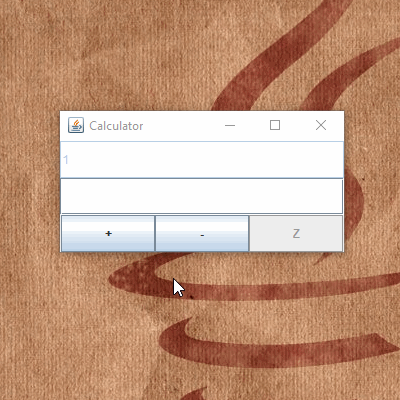

# CalculatorJava

A simple calculator made in Java  
  

## Instructions

Press '+' to add a number or increment by 1 if no number is inputted  
Press '-' to subtract a number or decrement by 1 if no number is inputted  
Press 'Z' to clear  

## Built With

* [Java Swing](https://docs.oracle.com/javase/tutorial/uiswing/) - The gui used  

## Acknowledgments

* This is a project from MOOC.FI  
